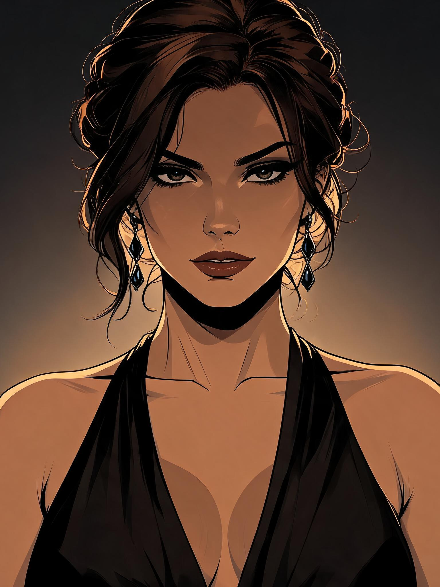
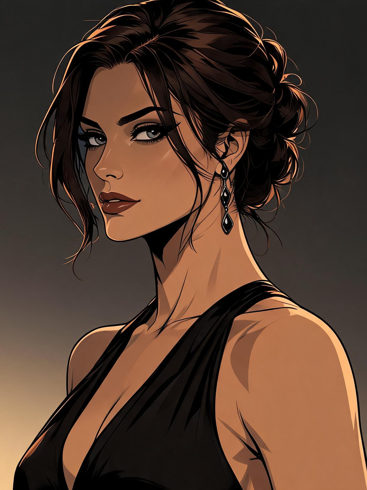
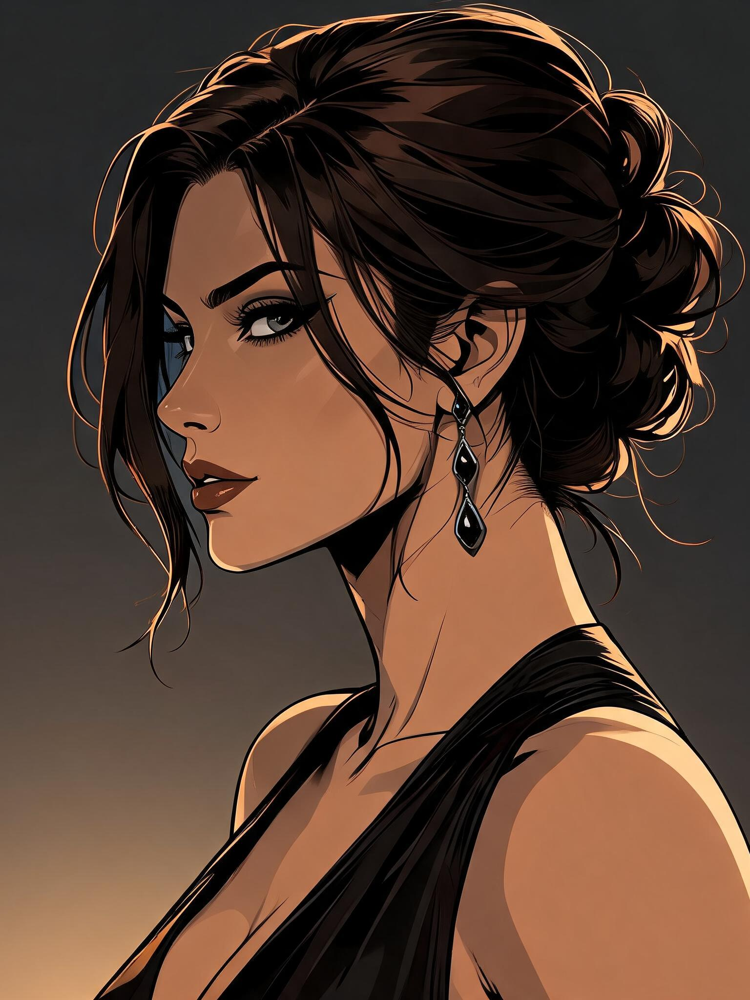
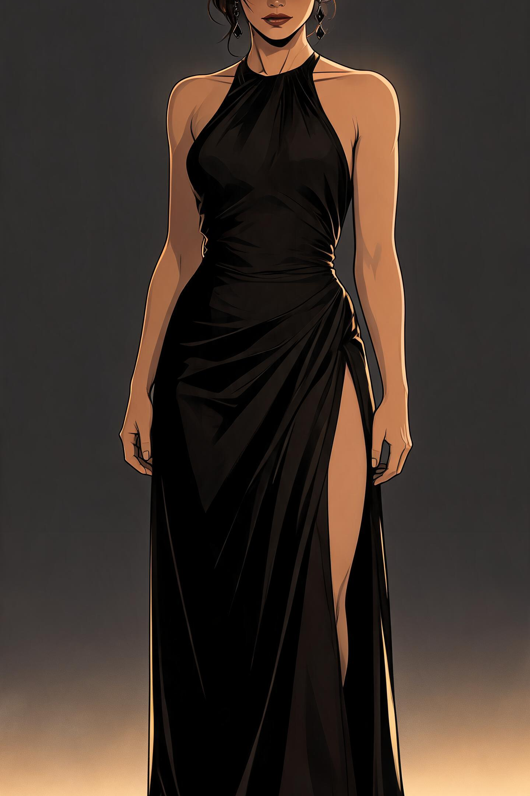

# Evelynn four-view candidate review — 2026-09-16

> **Approval update, 2026-09-16:** The project owner explicitly approved the front and
> three-quarter portraits as canonical references. Their active records and byte-identical
> PNGs are now under art/reference/evelynn; see
> [approval records](../../reference/evelynn/approved-portraits.json).
> Profile and full body remain staging/pending. The review below describes the original
> pre-approval milestone. Original staging PNGs and generation-run.json are retained as
> historical evidence; records.json now contains only the two remaining pending candidates.

All four originals remain **staging / pending**. PASS is a recommendation for human approval, not approval. No expressions/outfits, other characters, scene art, video, upscales or LoRA were generated.

## Provider, settings and cost

- ZenCreator MCP **image_editor / SEEDREAM_5**, one image per request.
- batch_mode=false; sequential_generation=false; rewrite_prompt=false. No LoRA.
- Portraits: 3:4, requested and measured **1536x2048 PNG**.
- Full body: 2:3, requested and measured **1536x2304 PNG**.
- Web previews are reduced WebP copies. Local originals are preserved without edits.
- Exact quotes and transaction-ledger charges: **1 credit each, 4 credits total**.
- Account balance 1108 before, 1100 after; a different task accounts for the other 4 credits.
- Original reference uploaded once, full quality, 2,028,885 bytes. Provider asset: `3cefac6d-fb4f-47a4-a2d8-d0a43f9971b6`.
- Approved source ID: evelynn-helix-gala-v1. SHA-256: `F4A6465602F1A9F77097322D4E2DBDB44CE71026B074D3ED38952B78013A2228`.
- Tools used: upload_asset, estimate_price, run_and_wait, wait_for_task, get_asset_preview_url, get_asset_download_url, get_me, list_credit_transactions. Phase 1 also used list_tools, get_tool_schema and compare_prices.

## IDs and exact provenance

| View | Spec/catalog ID | Provider task ID | Provider output asset ID | Review |
|---|---|---|---|---|
| Front | evelynn-canon-front-v1 | ad81e5b4-333b-4676-a892-9cb9aa39f784 | 2780ce8a-310f-48b9-ac39-6ad16c5aa9bd | PASS |
| Three-quarter | evelynn-canon-three-quarter-v1 | 1735ca21-aae9-484d-aebd-ad08e6c99dc0 | 6bfdd68c-27ab-40a5-b362-6e742e5e3940 | PASS |
| Profile | evelynn-canon-profile-v1 | bfb78511-1b74-42f3-b975-27705b252e62 | bd85e918-08aa-4877-b519-487c1711a272 | REVISE |
| Full body | evelynn-canon-fullbody-v1 | 4382b6ed-bdff-44d9-ba07-39396a55dabf | 5ffb7d52-2c5f-495a-8e7f-465c92b9d1ae | REJECT |

[Generation run](generation-run.json) contains call IDs, timestamps, exact request payloads, prompt components, settings, measured dimensions, hashes and task-linked billing transactions. [Catalog records](records.json) contain provenance and review recommendations.

## Previews and individual review

### Front — PASS

Recognizable relative to gala reference: almond eyes, angular cheeks, controlled lips, near-black updo and adult facial proportions are coherent. Polished 2D linework and semi-cel shading remain consistent.

Front-facing camera and neutral poised shoulders meet the primary facial-reference purpose. Crown is tightly cropped, brows/lips slightly bolder and expression slightly more self-assured than gala; owner should review these differences.

Eligible for human approval as a face candidate only; no canonical promotion.

### Three-quarter — PASS

Closest match to gala facial silhouette, eye shape, nose, lips, hairline and updo; rendering remains within the same EVE illustration language.

Three-quarter angle is usable for conversation reference. Crown is tightly cropped; makeup is slightly stronger and neckline is inferred from a back-view source.

Eligible for human approval as a portrait candidate only; no canonical promotion.

### Profile — REVISE

Identity, adult age appearance, hair and graphic-novel style remain broadly consistent with gala/front/three-quarter.

Fails the requested strict 90-degree profile: far eye remains visible, producing another three-quarter view. Cannot lock a true profile silhouette from this result.

Recommend regenerate with stronger side-view composition guidance after owner review; do not reuse as a canonical profile.

### Full body — REJECT

Original 1536x2304 PNG crops off upper face/hair and feet despite explicit head-to-toe instructions; it cannot establish height or complete body proportions.

Visible torso/arms retain a slim adult silhouette and 2D noir rendering, but gown front/neckline differs from portrait candidates; concealed legs and missing feet prevent complete anatomy assessment.

Reject this candidate for full-body reference. Recommend a new wider head-to-toe composition after owner review, not upscaling this crop.

## Cross-view assessment and next step

The three portraits are broadly coherent in face shape, almond eyes, nose, lips, hairline, cheekbones and adult age appearance. The front reads slightly more self-assured; brows and makeup are stronger than the gala. Tight portrait crops limit whole-hair silhouette checks. The gown front is inferred from a back-view source; the full-body halter neckline differs from the portraits.

All four preserve polished illustrated linework, semi-cel shadows, charcoal/gold contrast and restrained backgrounds. No obvious photorealism, plastic CGI or generic anime drift. Full-body height, complete anatomy and face cannot be assessed because the original itself is cropped; this is not a preview issue. Gown coverage also limits leg-proportion inspection.

**Reference-only likeness is promising but the full canonical pack is not established.** Profile and full-body composition failed. Source composition may be resisting camera changes; this is an inference, not a verified backend diagnosis. No evidence yet justifies LoRA training. After owner review, the smallest next step is a bounded profile/full-body retry with stronger pose and framing control.

Front and three-quarter: recommend approve candidate for facial/conversational reference, subject to owner acceptance of the noted differences. Profile: regenerate. Full body: reject current candidate for its intended use and generate a new head-to-toe composition after owner review. No retries were submitted.

## Architecture and changed files

Reused existing Art Bible, VisualAssetSpec, catalog, role/approval states and player-character/evelyn subject pairing. Presentation does not imply identity acceptance, biography or gameplay state.

- Modified src/visual/schema.ts: optional strict generation provenance, separate review recommendation and staging-path validation.
- Modified src/visual/catalog.ts: loads pending receipts and rejects receipt-based promotion.
- Added src/visual/evelynn-specs.json and evelynn-specs.ts: nine structured, validated specs.
- Added tools/visual/zencreator/provider.mjs, provider.d.mts and README.md: small pure offline request/receipt adapter; no network client or runtime dependency.
- Added tests/state/visual-production.test.ts: scope, reference IDs, payload integrity, provenance, file hashes, approval separation and runtime import boundary.
- Added four PNGs, records.json, generation-run.json and REVIEW.md under art/staging/evelynn/.

Prompts assemble EVE_STYLE + EVELYNN_CANON + REFERENCE_IMAGE + ASSET_TYPE + POSE + CAMERA + WARDROBE + LIGHTING + MOOD + ENVIRONMENT. Exact assembled prompts are recorded; they are not canonical story data. Each view uses only the original approved gala source.

Five planning-only specs remain ungenerated: evelynn-expression-sheet-v1, evelynn-gala-v1, evelynn-business-v1, evelynn-operational-v1, evelynn-private-v1.

## Validation and repository state

- Focused visual/production/identity tests: **18 passed**.
- TypeScript and production build: **passed**, with Vite's large-bundle warning.
- Git whitespace check: passed.
- Original reference and existing modified review-results/journal-narrow-final.png preserved.
- No story, gameplay, save schema, content version or dependency changes.
- Branch story/chapter-3-design; base 6a63441be8eb1777dd0435feb08c18f822f8528f.
- Work is **local, uncommitted and unpushed**. Empty saved EVE project folder remains untouched.

**Stopped for human review. No candidate has been promoted to production or canon.**
